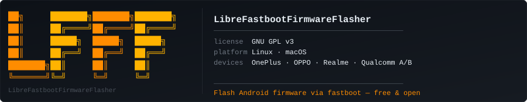

<div align="center">



[](https://www.gnu.org/licenses/gpl-3.0)
[](https://www.rust-lang.org)
[](https://slint.dev)
[](https://github.com/mrFrok/LibreFastbootFirmwareFlasher)
[](https://github.com/mrFrok/LibreFastbootFirmwareFlasher/releases)

**Free, open-source firmware flasher for Android A/B devices via fastboot.**  
CLI + GUI — single static binary, no Python, no bloat. Built with [Slint](https://slint.dev).

[Installation](#installation) · [Quick Start](#quick-start) · [CLI Commands](#cli-commands) · [Tested Devices](#tested-device) · [Development](#development)

</div>

---

## About

LFFF flashes full firmware on **OnePlus / OPPO / Realme** devices with Qualcomm SoC and A/B partition layout. Handles the entire pipeline — extraction, pre-flash checks, Anti-Rollback protection, dynamic super partitions, A/B slot management, modem flashing.

**CLI** (`lfff`) — scriptable, headless.  
**GUI** (`lfff-gui`) — native desktop app built with [Slint](https://slint.dev).

`full flash` · `A/B slots` · `ARB protection` · `source build flash` · `OTA extraction` · `download` · `single-partition flash` · `error recovery` · `dependency installer`

✈️ [Author](https://t.me/mrFrok228) · 👥 [Community](https://t.me/gt3neo5hub) · ☕ [Donate](https://boosty.to/mrfrok/donate)

---

## Installation

**Any Linux / macOS (one-liner)**
```bash
curl -fsSL https://raw.githubusercontent.com/mrFrok/LibreFastbootFirmwareFlasher/main/install.sh | bash

# Flags: --cli-only | --gui-only | --uninstall
```

Installs to `~/.local/bin` — works on **all** Linux distros including atomic/immutable (Fedora Silverblue, Bazzite, NixOS, SteamOS) and macOS.

**Arch Linux (AUR)**
```bash
yay -S lfff         # build from source
yay -S lfff-bin     # prebuilt binary
```

**Homebrew (macOS / Linux)**
```bash
brew tap mrFrok/lfff
brew install lfff
```

**Nix / NixOS**
```bash
# Install GUI (default)
nix profile install github:mrFrok/LibreFastbootFirmwareFlasher

# Or install CLI only
nix profile install github:mrFrok/LibreFastbootFirmwareFlasher#lfff-cli

# Run directly without installing
nix run github:mrFrok/LibreFastbootFirmwareFlasher        # GUI
nix run github:mrFrok/LibreFastbootFirmwareFlasher#cli    # CLI

# Development shell
nix develop github:mrFrok/LibreFastbootFirmwareFlasher
```

Then install external tools:
```bash
lfff deps
```

---

## Quick Start

```bash
lfff-gui                                   # Launch GUI

lfff deps                                  # Install fastboot, adb, aria2c, payload_dumper
lfff download https://.../firmware.zip     # Download OTA
lfff extract firmware.zip                  # Extract OTA
lfff flash ./firmwares/RMX3709             # Flash full firmware
lfff flash --source /out/target/product/   # Flash from source build
```

---

## CLI Commands

| Command | What it does | Example |
|---|---|---|
| `flash <dir>` | Full firmware flash, A/B slots | `lfff flash ./fw --dry-run` |
| `flash-partition` | Flash a single partition | `lfff flash-partition boot --firmware-dir ./fw` |
| `extract <zip>` | Extract OTA via payload_dumper | `lfff extract fw.zip -o ./out` |
| `download <url>` | Multi-connection OTA download | `lfff download <url> -c 8` |
| `devices` | List fastboot/adb devices | `lfff devices --check` |
| `arb` | Compare ARB: firmware vs device | `lfff arb --firmware-dir ./fw` |
| `deps [tool..]` | Install missing dependencies | `lfff deps` / `lfff deps --check` |

Full flag reference: `lfff <command> --help`.

**Flash flow:**

```
[Stage 1 — fastbootd]
  Non-super partitions  →  slot A  +  slot B
  Super/dynamic parts   →  active slot only (super wiped first)
      ↓
[Stage 2 — bootloader]
  modem  →  slot A  +  slot B
      ↓
[Offer: reboot to system  /  wipe data + reboot]
```

On error: **retry** / **reboot** / **skip partition** / **abort**

**MediaTek vs Qualcomm:** MediaTek devices flash entirely through fastbootd without preloader partition, and have no Anti-Rollback protection (ARB is Qualcomm-specific).

---

## Tested Devices

| Device | Model | Status |
|--------|-------|--------|
| Realme GT Neo 5 | RMX3709 | ✅ Working |
| Realme GT Neo 5 SE | RMX3700 | ✅ Working |

Other OnePlus / OPPO / Realme devices with Qualcomm SoC and A/B layout should work. May work on MediaTek devices.

---

## Development

```bash
git clone https://github.com/mrFrok/LibreFastbootFirmwareFlasher
cd LibreFastbootFirmwareFlasher
cargo build --release -p lfff-cli     # CLI only
cargo build --release -p lfff-gui     # GUI only
cargo test
```

```
LibreFastbootFirmwareFlasher/
├── Cargo.toml
├── README.md
├── LICENSE
├── logo.svg
├── lfff-gui.desktop
├── lfff-gui.svg
├── install.sh
├── lib/
│   └── src/
│       ├── lib.rs
│       ├── arb.rs
│       ├── deps.rs
│       ├── device.rs
│       ├── downloader.rs
│       ├── extractor.rs
│       ├── flasher.rs
│       └── utils.rs
├── cli/
│   └── src/main.rs
└── gui/
    ├── build.rs
    ├── src/main.rs
    └── ui/main.slint
```

---

## Special Thanks

- [NeFeroN](https://t.me/NeFeroN) — original Windows program author, help with flash implementation, Windows version
- [MisterZtr](https://github.com/MisterZtr) — partial MediaTek support

---

## Uninstall

```bash
curl -fsSL https://raw.githubusercontent.com/mrFrok/LibreFastbootFirmwareFlasher/main/install.sh | bash -s -- --uninstall
```

---

## Star History

If LFFF saved you time or a bricked device — a ⭐ goes a long way!

<a href="https://www.star-history.com/#mrFrok/LibreFastbootFirmwareFlasher&Date">
 <picture>
   <source media="(prefers-color-scheme: dark)" srcset="https://api.star-history.com/svg?repos=mrFrok/LibreFastbootFirmwareFlasher&type=Date&theme=dark" />
   <source media="(prefers-color-scheme: light)" srcset="https://api.star-history.com/svg?repos=mrFrok/LibreFastbootFirmwareFlasher&type=Date" />
   
 </picture>
</a>

---

## License

[GNU GPL v3](LICENSE). Uses [Slint](https://github.com/slint-ui/slint) (GPL v3) and Material Design 3 icons (Apache 2.0).
